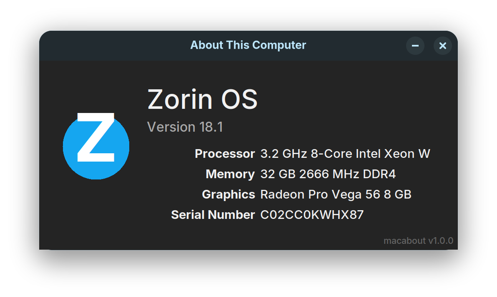

# macabout

`macabout` presents your Linux machine's hardware in the same format as macOS (via "About this Mac...")

If you're on a re-purposed Mac and need to see a simple system summary, this makes complete sense.



I created this project because Linux system info is never presented in the same way as a mac machine, and therefore I found it frustrating to compare or understand exactly what Mac I have.
Having a Mac machine isn't compulsory for `macabout` to work - it will still read system information whatever the hardware, but might not make as much sense.

## Installing on Linux

Download the latest `.deb` from the [Releases](https://github.com/PandaWood/macabout/releases) page, then:

```bash
sudo apt install ./macabout_1.0.0_all.deb
macabout
```

`apt` automatically installs all dependencies (`python3-tk`, `pciutils`) before macabout runs.

## Running from source (developers)

```bash
git clone https://github.com/PandaWood/macabout.git
cd macabout
sudo apt install python3-tk python3-venv python3-pip pciutils dmidecode
make dev
source .venv/bin/activate
python3 -m macabout
```

## Developing on macOS

tkinter ships separately from Python on macOS. Install both via Homebrew, matching the version numbers:

```bash
brew install python@3.14
brew install python-tk@3.14
```

Then set up the virtualenv:

```bash
make dev
source .venv/bin/activate
```

Run:

```bash
make mock     # static Zorin OS sample data (good for UI work)
make run      # real macOS system calls
```

Or directly:

```bash
python -m macabout --mock
```

`requirements.txt` contains only `Pillow`, which enables clean icon resizing. Everything else (`tkinter`, `subprocess`, `pathlib`, etc.) is Python standard library.

**Requires:** Python 3.10+, `python3-tk`, `pciutils`, `dmidecode`

## What it shows

| Field | Source | Example output |
|---|---|---|
| Distro name | `/etc/os-release` | Zorin OS |
| Version | `/etc/os-release` | Version 17.1 |
| Processor | `/proc/cpuinfo` | 3.2 GHz 8-Core Intel Xeon W |
| Memory | `/proc/meminfo` + `dmidecode` | 8 GB 1600 MHz DDR3 |
| Graphics | `lspci` + bundled lookup table | Radeon Pro Vega 56 8 GB |
| Serial Number | `dmidecode` | C02J1234XYZA |

Memory speed/type and serial number require `dmidecode`. If unavailable (e.g. not installed or no root access), those fields degrade gracefully.

## Distro icon

The icon is sourced from the running system's own branding, in this order:

1. `LOGO=` field in `/etc/os-release` (explicit XDG icon name — most authoritative)
2. `distributor-logo` (FreeDesktop standard, present on most distros)
3. `distributor-logo-{id}`, `{id}-logo`, `{id}` (fallback guesses)
4. A bundled PNG at `macabout/data/icons/{distro_id}.png` if present
5. A brand-colored circle with the distro's initial letter (pure tkinter, no extra deps)

To add a bundled icon for a distro, drop a PNG named `{distro_id}.png` (200×200px) into `macabout/data/icons/`. The `distro_id` matches the `ID=` field in `/etc/os-release` (e.g. `zorin.png`, `ubuntu.png`).

## GPU lookup table

Graphics card names and VRAM figures (displayed in GB) are resolved via `macabout/data/gpu_lookup.json`, keyed by PCI vendor:device ID (e.g. `"8086:0a26"`). The file ships with ~60 entries covering Intel HD/Iris/UHD Graphics from Sandy Bridge through Coffee Lake, plus a handful of common AMD and NVIDIA cards. On Linux, VRAM is also read from the AMD sysfs interface as a fallback for cards not in the lookup. Add entries to extend coverage without touching application code.

## Building the .deb

```bash
./build.sh
sudo apt install ./build/macabout_1.0.0_all.deb
```

Requires `dpkg-deb` (standard on Debian/Ubuntu).

