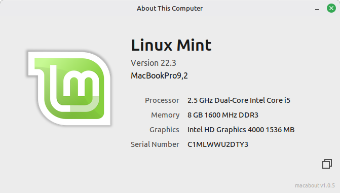
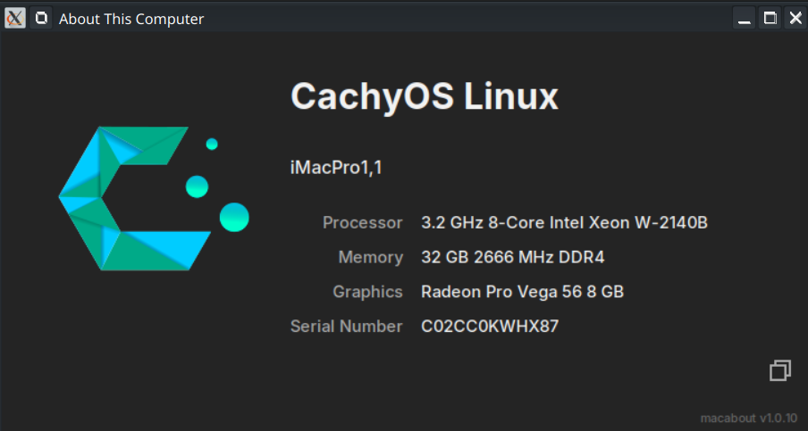

# macabout

`macabout` presents your Linux machine's hardware in the same format as macOS ("About this Mac...")

If you're on a re-purposed Mac and need to see a simple system summary, this makes complete sense.

| Linux Mint | CachyOS |
|:---:|:---:|
|  |  |

## Installing on Linux

### Quick install (one-line)

For supported distros (Debian/Arch based):

```bash
curl -sSL https://pandawood.github.io/macabout/install.sh | bash
```
### Manual install

To do it by hand:

**Debian, Ubuntu, Mint, Zorin** — download the `.deb` from [Releases](https://github.com/PandaWood/macabout/releases):

```bash
sudo apt install ./macabout_*.deb
```

**Arch, CachyOS, Manjaro, EndeavourOS** — build the `PKGBUILD`:

```bash
curl -sSLO https://pandawood.github.io/macabout/PKGBUILD
makepkg -si
```

> An AUR package (`paru -S macabout`) is planned.

## Compatibility

macabout reads system information from standard Linux interfaces and therefore works on any modern Linux distro (or macOS). Only the **packaging** is distro-specific — the one-line installer covers the first two rows:

| Distro family                        | What the installer does                      |
|--------------------------------------|----------------------------------------------|
| Debian, Ubuntu, Mint, Zorin…         | Installs the `.deb`                          |
| Arch, CachyOS, Manjaro, EndeavourOS… | Builds the `PKGBUILD`                        |
| Fedora, openSUSE, …                  | Not packaged — run from source (see below)   |

Both packages install a sudoers rule so `dmidecode` runs without a password prompt. 
On other distros you'll need to run macabout with `sudo` to see memory speed/type, the machine model and the serial number.

## Why?
I use old Macs with Linux installed and system-info is not presented in the same way; so I found it slightly annoying to understand exactly what Mac I have. Just annoying enough to crack out Claude Code and finally do something useful with it, for probably 10% of users ;-)

Having a Mac isn't compulsory for `macabout` to work - it's compatible with any hardware, but might not make as much sense.

## What macabout shows

| Field | Source | Example output |
|---|---|---|
| Distro name | `/etc/os-release` (`NAME`) | Zorin OS |
| Version | `/etc/os-release` (`VERSION`, parenthesised suffix stripped) | Version 17.1 |
| Machine model | `dmidecode -s system-product-name` (unlabelled line; hidden if absent or OEM placeholder) | MacBook Air (13-inch, Mid 2013) |
| Processor model | `/proc/cpuinfo` (`model name`), cleaned up by family | Intel Xeon W |
| Processor speed | `/proc/cpuinfo` (`@ X.Y GHz` in model name) | 3.2 GHz |
| Core count | `/proc/cpuinfo` — unique `(physical id, core id)` pairs | 8-Core |
| Memory size | `/proc/meminfo` (`MemTotal`), nearest GB | 8 GB |
| Memory speed/type | `dmidecode -t memory` | 1600 MHz DDR3 |
| Graphics | `lspci -nn` PCI ID → bundled `gpu_lookup.json`; falls back to parsed `lspci` name + AMD sysfs VRAM | Radeon Pro Vega 56 8 GB |
| Serial Number | `dmidecode -s system-serial-number` | C02J1234XYZA |

Memory speed/type, machine model, and serial number require `dmidecode`.

## Running from source (devs or deviants)

This is also the path for anyone not on a Debian- or Arch-family distro... Replace the `apt` command with your package manager's equivalent.

```bash
git clone https://github.com/PandaWood/macabout.git
cd macabout
sudo apt install python3-tk python3-venv python3-pip pciutils dmidecode
make dev
source .venv/bin/activate
make test            # optional: run the test suite
sudo python3 -m macabout
```

## Developing on macOS

If you don't have a linux machine nearby and you're desperate to work on it...
**tkinter** ships separately from Python on macOS. Install both via Homebrew, matching the version numbers:

```bash
brew install python@3.14
brew install python-tk@3.14
```
Then setup/run:

```bash
make dev
source .venv/bin/activate
make mock     # static Zorin OS sample data (good for UI work)
make run      # real macOS system calls
```

## Distro icon

The icon is sourced from the running system's own branding, in this order:

1. A bundled PNG at `macabout/data/icons/{distro_id}.png`, if one ships with macabout
2. Otherwise the system's own icon, tried by name in this order:
   - `LOGO=` field in `/etc/os-release` (explicit XDG icon name — most authoritative)
   - `distributor-logo` (FreeDesktop standard, present on most distros)
   - `distributor-logo-{id}`, `{id}-logo`, `{id}` (fallback guesses)
3. A brand-colored circle with the distro's initial letter (pure tkinter, no extra deps)

Each name is looked for under the `hicolor` theme directories, `/usr/share/pixmaps`, and `/usr/share/icons` itself — some distros drop their logo loose in the icon root rather than in a theme directory (CachyOS ships `/usr/share/icons/cachyos.svg`).

SVG logos are rendered by whichever of `rsvg-convert`, ImageMagick's `convert` or `inkscape` is installed. Pillow improves the downscaling quality but is not required.

To add a bundled icon for a distro, drop a PNG named `{distro_id}.png` (200×200px) into `macabout/data/icons/`. The `distro_id` matches the `ID=` field in `/etc/os-release`.

## GPU lookup table

Graphics card names and VRAM figures (displayed in GB) are resolved via `macabout/data/gpu_lookup.json`, keyed by PCI vendor:device ID (e.g. `"8086:0a26"`). 
The file ships with ~60 entries covering Intel HD/Iris/UHD Graphics from Sandy Bridge through Coffee Lake, plus a handful of common AMD and NVIDIA cards. On Linux, VRAM is also read from the AMD sysfs interface as a fallback for cards not in the lookup. Add entries to extend coverage without touching code.
